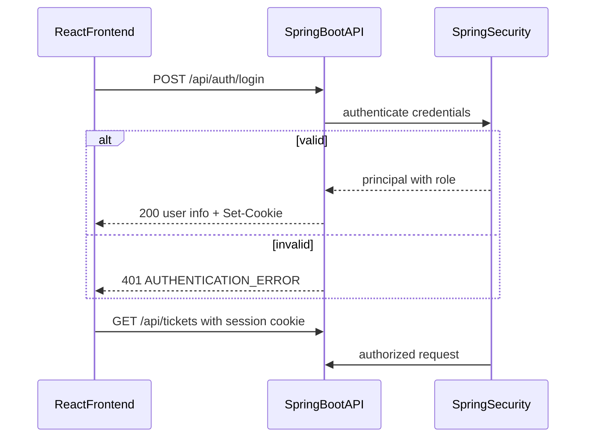

# Architecture Specification

## 1. Architecture Style

The application shall use a modular monolith architecture.

The backend shall use a layered Spring Boot architecture:

```text
Controller
    ↓
Service
    ↓
Repository
    ↓
PostgreSQL
```

The domain/business rules shall remain independent of HTTP concerns where practical.

The frontend shall communicate with the backend exclusively through REST APIs.

---

# 2. Technology Stack

| Layer           | Technology                          |
| --------------- | ----------------------------------- |
| Language        | Java 21                             |
| Backend         | Spring Boot                         |
| Build           | Gradle                              |
| API             | REST                                |
| Persistence     | Spring Data JPA                     |
| Database        | PostgreSQL                          |
| Test Database   | H2/Testcontainers where appropriate |
| Frontend        | React                               |
| Version Control | Git/GitHub                          |
| IDE/AI          | Cursor                              |

---

# 3. Backend Structure

Recommended structure:

```text
backend/
└── src/
    ├── main/
    │   ├── java/
    │   │   └── .../
    │   │       ├── controller/
    │   │       ├── service/
    │   │       ├── repository/
    │   │       ├── entity/
    │   │       ├── dto/
    │   │       ├── exception/
    │   │       ├── mapper/
    │   │       └── config/
    │   └── resources/
    │       └── application.yml
    │
    └── test/
        └── java/
```

Package names should follow the project's actual base package.

---

# 4. Layer Responsibilities

## Controller

Responsible for:

* HTTP request handling
* request/response mapping
* validation trigger
* HTTP status codes

Controllers must not contain business rules.

## Service

Responsible for:

* business logic
* state transitions
* orchestration
* transaction boundaries

## Repository

Responsible for:

* persistence
* database queries

## Entity

Responsible for persistence representation.

## DTO

Responsible for API contracts.

## Exception

Responsible for domain/application-specific errors.

---

# 5. Error Handling

Use a centralized exception handling mechanism such as `@RestControllerAdvice`.

Errors should return a consistent structure.

Example:

```json
{
  "timestamp": "2026-01-01T10:00:00Z",
  "status": 400,
  "error": "VALIDATION_ERROR",
  "message": "Request validation failed",
  "path": "/api/tickets"
}
```

The exact implementation may evolve while preserving the API contract.

---

# 6. Validation

Use Jakarta Bean Validation where appropriate.

Examples:

* `@NotBlank`
* `@Size`
* `@NotNull`

Business validation that cannot be expressed through annotations belongs in the service/domain layer.

---

# 7. Transactions

Operations that modify persistent state shall use appropriate transaction boundaries.

A ticket state transition shall be atomic.

Adding a comment shall persist the comment consistently with the associated ticket.

---

# 8. Database

PostgreSQL is the primary application database.

Database schema evolution should be managed through an appropriate migration mechanism such as Flyway if introduced by the implementation.

Credentials must come from environment/configuration and must never be hardcoded.

---

# 9. Frontend Architecture

Recommended:

```text
frontend/
├── src/
│   ├── components/
│   ├── pages/
│   ├── services/
│   ├── types/
│   ├── hooks/
│   └── utils/
└── ...
```

The frontend shall:

* call backend APIs
* display ticket information
* provide forms
* validate obvious input
* display backend errors
* provide search/filter controls
* provide status transition controls

The frontend must not be responsible for enforcing the authoritative state machine.

---

# 10. Dependency Direction

```text
Controller
   ↓
Service
   ↓
Repository
   ↓
Database
```

Dependencies must not flow backwards.

Controllers must not directly access repositories when business logic is required.

---

# 11. Simplicity Principle

Do not introduce:

* microservices
* Kafka
* Redis
* distributed transactions
* complex event-driven architecture

unless a later requirement explicitly requires them.

---

# 12. Authentication

## Approach

The application shall use **Spring Security** with **HTTP session-based authentication** (cookie-based).

This is the simplest authentication approach appropriate for this assignment. The system shall not introduce external identity providers, OAuth authorization servers, or distributed authentication infrastructure.

## Authentication Flow

```text
1. User opens login screen
2. User submits username and password
3. Frontend calls POST /api/auth/login
4. Backend authenticates via Spring Security AuthenticationManager
5. On success: session established (JSESSIONID cookie), user identity and role returned
6. Subsequent API calls include session cookie (credentials: include)
7. Frontend calls GET /api/auth/me on startup to restore role-aware state
8. User may call POST /api/auth/logout to end session
```



## Role Representation

* Backend roles: `ROLE_ADMIN`, `ROLE_USER`
* API/frontend role values: `ADMIN`, `USER`
* Roles are assigned at authentication time from configured demo users

## Demo-User Configuration

Demo users shall be configured in `application.yml` (with optional environment-variable overrides), not embedded in ticket business logic.

Example structure:

```yaml
app:
  security:
    demo-users:
      - username: admin
        password: ${DEMO_ADMIN_PASSWORD:admin123}
        role: ADMIN
      - username: user
        password: ${DEMO_USER_PASSWORD:user123}
        role: USER
```

A dedicated `UserDetailsService` (or equivalent configuration bean) shall load users from this configuration.

Passwords shall be encoded using Spring Security's `PasswordEncoder` (e.g. BCrypt).

Demo credentials shall be documented in `README.md` with a development/demo-only warning.

## Backend Authorization

Authorization shall be enforced by Spring Security:

* `SecurityFilterChain` protects `/api/**` endpoints
* `POST /api/tickets` requires `ROLE_ADMIN`
* Other ticket endpoints require authentication; `USER` and `ADMIN` are both permitted unless explicitly restricted
* Unauthenticated requests receive `401 Unauthorized`
* Forbidden operations receive `403 Forbidden`

`AccessDeniedException` shall be handled by `GlobalExceptionHandler` and return the consistent `ErrorResponse` format with `error: "FORBIDDEN"`.

Method-level `@PreAuthorize` or equivalent request matchers may be used on controllers.

## Frontend Role Awareness

The frontend shall:

* Provide a login page as the entry point for unauthenticated users
* Store authenticated state via session cookie (not local business-logic credentials)
* Call `GET /api/auth/me` to obtain current username and role
* Use role information for UI visibility only (e.g. hide Create Ticket for USER)
* Never treat frontend role checks as a security boundary

## Separation of Concerns

Authentication and authorization components shall be separate from ticket business logic:

```text
config/security/     SecurityFilterChain, UserDetailsService
controller/AuthController   login, me, logout
controller/TicketController ticket operations (authorization enforced externally)
service/TicketService       ticket business rules (unchanged)
```

## CORS and Session

For local development, the Vite dev server proxies `/api` to the backend. The frontend shall send requests with `credentials: 'include'` so session cookies are transmitted.

CSRF protection may be disabled for the REST API session approach used by the SPA, documented as an intentional simplification for this assignment.

